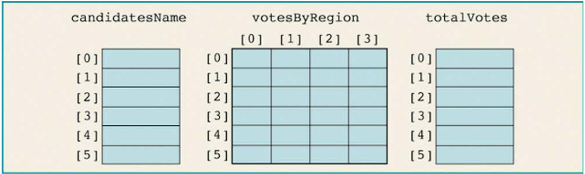
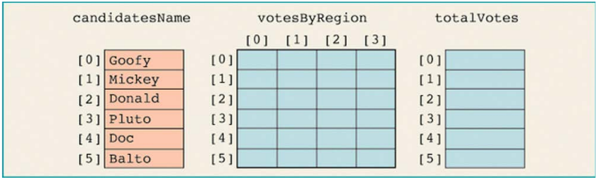
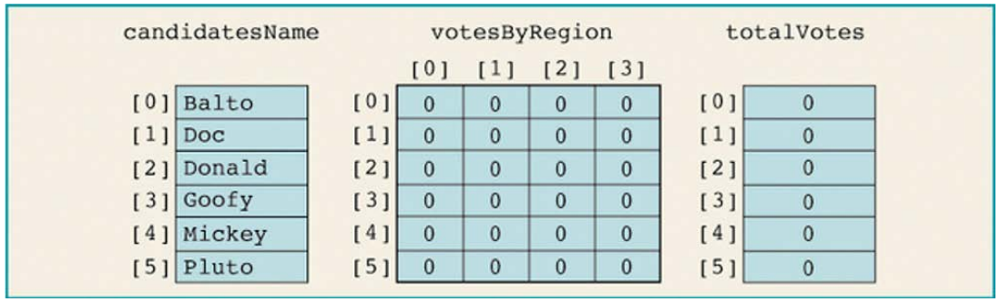
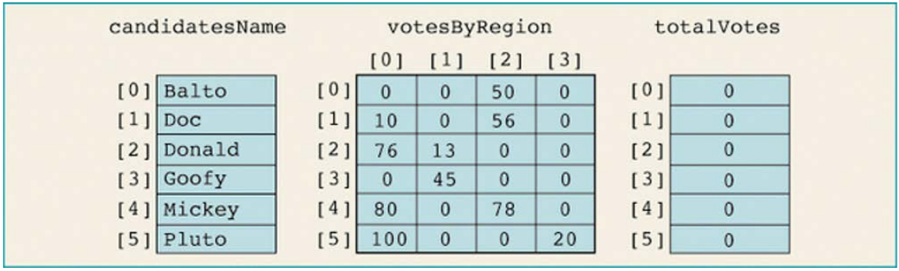

# seçim sonuçları

**Bu ödev, C++ programlama dili kullanarak diziler, matrisler,**
**sınıf ve nesne hakkında pratiğe dayalı bir deneyim sunmayı**
**amaçlamaktadır. Ödevle ilgili önemli bilgiler devamında verildiği**
**gibidir.**

Yerel bir üniversitenin öğrenci konseyi için başkanlık seçimi
yapılacaktır. Gizlilikle ilgili nedenlerden dolayı, oylama bilgisayar
ortamında yapılacaktır. Verilerin analiz edileceği ve
kazananın bildirileceği bir program yazılması beklenmektedir.
Program ile ilgili detaylar şu şekildedir:

Üniversitenin dört ana bölümü vardır ve her bölümün birkaç
departmanı vardır. Seçimin amacı doğrultusunda, dört bölüm, Bölge 1,
Bölge 2, Bölge 3 ve Bölge 4 olarak etıketlenmiştır. Her
bölümdeki her departman kendi oylama sürecini yönetır ve her adayın
aldığı oyları doğrudan seçim komitesine bildirir.

Veriler iki dosya halinde sunulmaktadır. Bir dosya, örneğin
`candDat.txt`, başkanlık makamına aday olan isimlerinden oluşmaktadır.
Dosyadaki adayların isimleri belirli bir sırada değildir. İkinci
dosyada, örneğin `voteData.txt`, her satır aşağıdaki biçimde oylama
sonuçlarından oluşmaktadır:

adayAdı bölgeNumarası BuAdayİçinOySayısı

**Örneğin, girdi dosyası şöyle görünür:**

```text
Donald 1 23
Pluto  2 56
Doc    1 25
Pluto  4 23
...
```

İlk satır Donald'ın 1. bölgeden 23 oy aldığını göstermektedir. *NOT:*
*Tüm adayların ayrı bölgelerden aldığı oylar Pluto örneğinde olduğu*
*gibi farklı satırlarda yer almalıdır.*

**Programa ait Girdi Verileri:** Biri aday isimlerini, diğeri
yukarıda açıklandığı gibi oy verilerini içeren iki dosya.

**Çıktı:** Seçim sonuçlarının ve kazananın konsol ekranında açıklandığı bir tablo.

## ödev açıklaması

- Program oylama verilerini bölgelere göre düzenlemelidir.
- Program ayrıca her adayın aldığı toplam oy sayısını ve seçimde
  kullanılan toplam oyu hesaplamalıdır.
- Adayların isimleri alfabetık sırada görünmelidir.
- Bir adayın adının veri türü (bir string) ile oy sayısının veri
  türü (bir integer) farklı olduğundan, biri adayların adlarını
  diğeri de oylama verilerini tutmak için iki ayrı diziye ihtıyacımız
  vardır.
- Adayların adlarını tutan dizi tek boyutlu bir dizidir ve bu
  dizinin her bir bileşeni bir string’tır.
- Oylama verilerini tutmak için tek bir iki boyutlu dizi kullanmak
  yerine, çıktının sonraki dört sütununu tutmak için iki boyutlu bir
  dizi ve her adayın aldığı toplam oyu tutmak için tek boyutlu bir
  dizi kullanılması gerekmektedir.
- NOT: Yapılacak tüm alt işlemler fonksiyonlarla gerçeklenmelidir.
- NOT: Tüm üye değişkenler ve üye fonksiyonlar “class” kullanarak
  tanımlanmalıdır.
- NOT: Hiçbir alt işlem için hazır fonksiyon kullanmayınız!

Yukarıda sözü geçen dizi ve matrisler için örnek görünüm ve isimler
aşağıdaki şekilde verildiği gibidir.



Yapılacak işlemler sırasıyla şu şekildedir:

1. Adayların isimlerini dosyadan okunmalı ve `candidatesName`
   dizisinde tutulmalıdır. Bu işlemden sonra tutulan dizilerin örnek
   görünümleri aşağıdaki gibi olmalıdır.

    

2. `candidatesName` dizisi sıralanmalıdır. Örnek isimler için
   sıralama görünümü aşağıdaki örnek şekilde verildiği gibi
   olmalıdır.

    

3. `votesByRegion` ve `totalVotes` dizileri oluşturulmalı ve
   ilklenmelidir. Bu işlemden sonra dizilerin örnek görünümleri aşağıdaki gibi olmalıdır.

4. Oylama verileri `voteDat.txt` dosyasından okunmalı ve
   işlenmelidir. Okuma işlemi tamamlandığında dizilerin örnek
   görünümleri aşağıdaki gibi olmalıdır. `voteDat.txt` isimli dosyada
   yer alacak ilk değerler için aşağıda tabloda verilen değerler
   kullanabilirsiniz.

    

5. Sonuçların aldığı toplam oy hesaplanmalıdır. Tüm adaylar için
   aynı işlemler tekrarlandıktan sonra diziler örnek olarak
   aşağıdaki gibi görünmelidir.

    

6. Sonuçların çıktısını alınmalıdır. Aşağıda konsol ekranı için örnek
   görünüm verilmektedir. Program çıktısının verilen şekilde
   görünmesine özen gösteriniz.

```console
--------------Election Results--------------
Candidate                Votes
Name     Region1 Region2 Region3 Region4 Total
--------- ------- ------- ------- ------- ------
Balto       0       0       0       272     272
Doc         25      71      156     97      349
Donald      110    158      0       0       268
Goofy       0       34      0       0       34
Mickey      112    141      156     89      498
Pluto       285     56      0       46      387

Winner: Mickey, Votes Received: 498
Total votes polled: 1808
```
